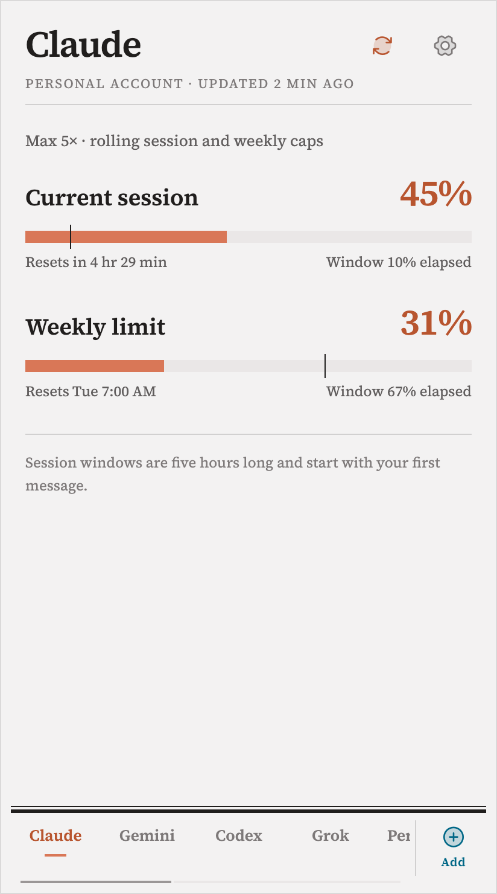
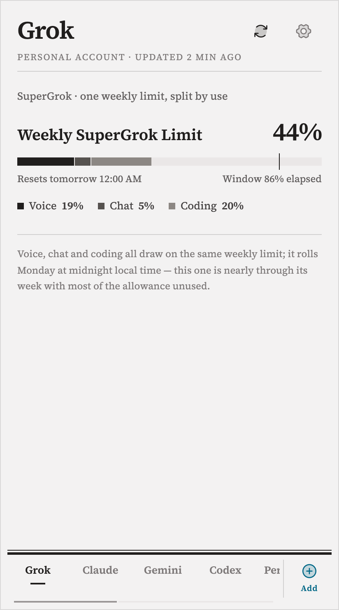
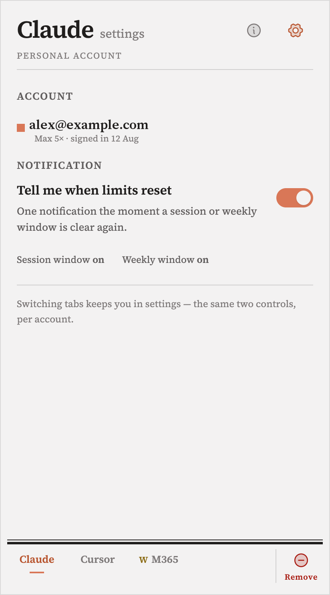
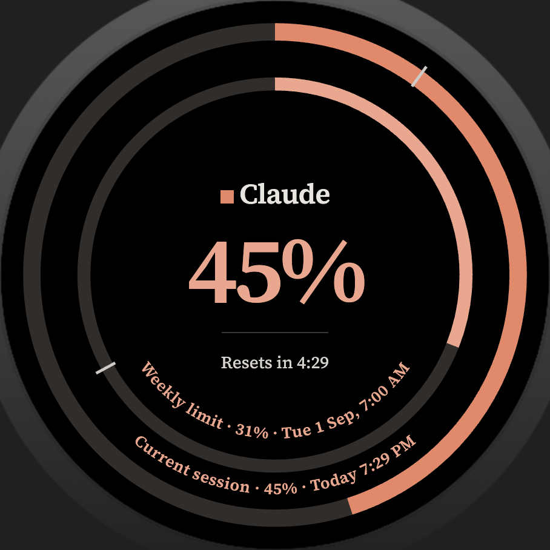
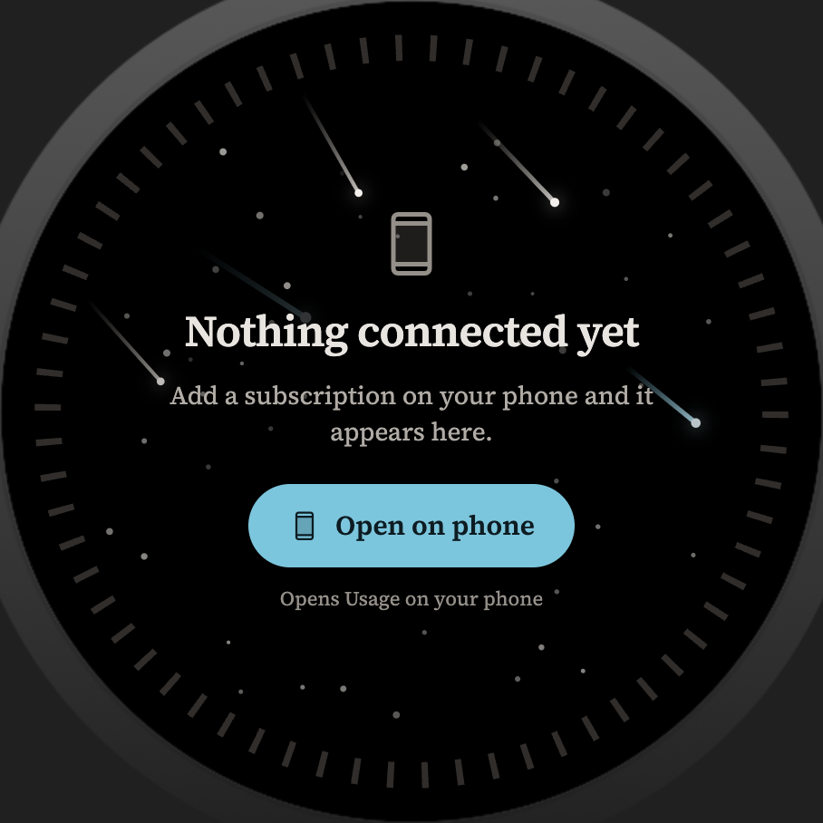

# AI-SUM

**Am I about to run out?** AI-SUM answers that for the AI subscriptions you pay for — Claude, Codex, SuperGrok, Cursor, and Grok Bot — on one Android screen and on a Wear OS watch.


AI subscriptions meter you in windows — a rolling five-hour session here, a weekly cap there — and each provider buries the number on a different settings page. Checking five of them means five logins. AI-SUM is one tab strip instead.

A percentage on its own does not tell you whether you are in trouble. 45% spent is fine on day six of a week and alarming forty minutes into a five-hour session. Every window therefore shows two quantities on one bar:

- **Fill** — how much of the allowance is spent
- **Hairline** — how much of the time window has elapsed

Fill ahead of the hairline means you are burning allowance faster than the clock. That comparison is the product.

Built by [Eric Peck](https://github.com/ericpeck). Kotlin, Jetpack Compose, a Wear OS companion.

This is an **unofficial prototype**. It is not affiliated with Anthropic, OpenAI, xAI, Cursor, or any other provider. It is not on Play Store. Provider HTML and usage surfaces change; live reads can break without a code change.

## What it does

- **Five live reads** — Claude, Codex, SuperGrok, Cursor, and Cursor-billed Grok Bot. Sign in once in a full-screen in-app WebView; the app reads the usage figure off the page you are already authenticated to.
- **No developer backend.** Sign-in and usage reads go to the provider (and its identity provider) in an in-app WebView. The app does not copy cookies out, does not write to any provider, and does not poll in the background.
- **Wear OS companion** draws the same windows as concentric arcs. The watch never signs in. The phone publishes a snapshot over the Wear Data Layer.
- **A window is a percentage plus a reset time.** Live reads and seeded fakes already produce that type. A dedicated manual-entry screen is not in this snapshot.
- **Broadsheet** — light, square-cornered, serif. Deliberately not Material 3 defaults. Source Serif 4 is bundled; cyan is the only interactive colour; red is reserved for breach and expired sessions.

## Privacy

There is no developer-operated backend and no analytics. That is not the same as “no network.”

Sign-in and usage reads happen in a full-screen in-app WebView. Those loads go to the provider (Claude, Codex, SuperGrok, Cursor) and, when the site uses them, to identity providers such as Google, X, Apple, GitHub, or Microsoft. The app does not copy cookies out of `CookieManager` and does not write to any provider. Reads run when you ask — open a live tab or use the header refresh — not on a background poll.

Private storage holds `accounts.json`: which tabs you added, cached plan and usage windows, and settings such as reset-notification toggles. Session cookies stay in Android’s `CookieManager`.

A paired Wear OS watch receives a usage snapshot over the Wear Data Layer (`/aisum/snapshot`). The watch never signs in.

## Screens

The images are **sanitized design-of-record board renders**, not captures of a signed-in device. Sample account labels use reserved example addresses. Some tab strips still show platforms that are no longer on the add list.

<table>
<tr>
<td width="50%">

<br><sub><b>Platform screen.</b> Two windows, two bars. Session fill sits well past its hairline — 45% spent, 10% of the window gone.</sub>
</td>
<td width="50%">

<br><sub><b>Segmented windows.</b> SuperGrok bills voice, chat, and coding against one weekly cap, so the bar splits rather than multiplying.</sub>
</td>
</tr>
<tr>
<td width="50%">

<br><sub><b>First run.</b> Shown only while nothing is connected.</sub>
</td>
<td width="50%">

<br><sub><b>Settings is a mode</b>, not a nested graph — the gear flips the platform screen in place. Remove is the log-out.</sub>
</td>
</tr>
</table>

<table>
<tr>
<td width="50%">

<br><sub><b>Wear OS.</b> One arc per window, curved reset labels, elapsed ticks. These are app screens, not system watch faces.</sub>
</td>
<td width="50%">

<br><sub><b>Empty watch.</b> Opens the phone app; the watch has no sign-in path of its own.</sub>
</td>
</tr>
</table>

On-screen copy still says **Usage Ledger**. That is design copy from the board. **AI-SUM** is the launcher name.

## How it works

**Reading usage.** Each platform implements a reader: a sign-in URL, a read URL, and JavaScript evaluated against the signed-in page. Results are a sealed type — success, free plan, needs sign-in, or failed. Sign-in is a full-screen in-app WebView sharing one `CookieManager` with the read, so OAuth popups get a real window. Chrome Custom Tabs were rejected: they would park the session in Chrome, out of reach of the in-page read.

**Modelling a window.** A window is a usage percent, an elapsed percent, a reset label, and optional segments. `usagePercent >= 90` is a breach. Live reads, seeded fakes, and manual entry all produce the same type.

**Drawing the bar.** One Compose `Canvas`: animated fill, optional gapped segments, and a 1 dp full-height hairline at the elapsed position.

**Reaching the watch.** The phone serialises its tab list and pushes it to `/aisum/snapshot`. `:wear` depends on `:core:wearbridge` and Play services Wearable only — no WebView, no auth, no providers. Arc math and board-to-density scaling are pure JVM, so they are unit-testable.

## Project layout

```
:app                 Phone — screens, WebView readers, Wear publisher
:wear                Wear OS APK, same applicationId, never signs in
:core:wearbridge     Snapshot DTOs, arc math, Data Layer paths (JVM)
```

```
AI-Sub-Use-Monitor-Vault/
  10 UI/             Design of record — screen board, outline, screenshots
  20 Research/       One dated evidence note per platform
  90 Agents/         Contributor and agent rules (AGENTS.md)
```

The Obsidian vault is in the repo on purpose. Each usage surface was torn down and written up before a parser was allowed near it.

## Build

**Requirements**

| Requirement | |
|---|---|
| JDK | 17+ (this repo’s Gradle daemon is set up for JDK 25) |
| Gradle | 9.6.0 via the wrapper |
| Android Studio / AGP | AGP 9.4.0, Kotlin 2.2.10 |
| Phone | Android 16 (API 36) for now — a prototype floor, not a product decision |
| Watch | Wear OS 5+ (`minSdk` 34) |

```bash
git clone https://github.com/ericpeck/AI-Subscription-Usage-Monitor-Public.git
cd AI-Subscription-Usage-Monitor-Public
./gradlew :app:assembleDebug
```

Phone and watch ship as independent APKs that share `applicationId` `com.ericmbpeck.ai_sum`. Sideload both; the Data Layer keys off the shared id.

```bash
./gradlew :app:installDebug
./gradlew :wear:installDebug
```

If more than one device is attached, set `ANDROID_SERIAL` so Gradle does not install to every device.

## Tests

Mappers, formatters, the account store, and watch arc math have unit tests.

```bash
./gradlew :app:testDebugUnitTest :core:wearbridge:test
```

## Not in this version

Spend and cost tracking, head-to-head comparison, trend charts, dashboards, and any server-side account are out of scope. So are Wear tiles, reset notifications, and background refresh.

Gemini, Perplexity, GitHub Copilot, and Microsoft 365 Copilot were researched and taken off the add list. The research notes stay in the vault.

## Contributing

Issues and pull requests are welcome. This is a personal prototype with a specific visual language; read **[AGENTS.md](AI-Sub-Use-Monitor-Vault/90%20Agents/AGENTS.md)** before changing UI, live readers, or the add list. In short:

1. Do not ship untested code. Pure logic needs a unit test that failed before the fix. Anything the user taps also needs the path exercised on an emulator.
2. Feature work ships as a PR off `main`, with a body that covers purpose, what changed, why it was built that way, how it was tested, and leftovers.

Do not attach live tokens, raw HAR files, login captures, cookie dumps, or real account screenshots to issues or pull requests. Use GitHub’s private vulnerability reporting for security issues once it is enabled on this repository.


## About this repository

This repository begins from a reviewed source snapshot of AI-SUM and is initialized with new Git history. It does not include the original private development commits, pull requests, or issue discussion.

## License

No license is granted yet for Eric Peck’s original code. Until one is added, all rights are reserved. Open an issue if you want to reuse that code.

Bundled third-party materials (including Source Serif 4) keep their own licenses; see `THIRD_PARTY_NOTICES.md`.

Not affiliated with Anthropic, OpenAI, xAI, Cursor, or any other AI provider. “Claude”, “ChatGPT”, “Grok”, and “Cursor” are trademarks of their respective owners.
